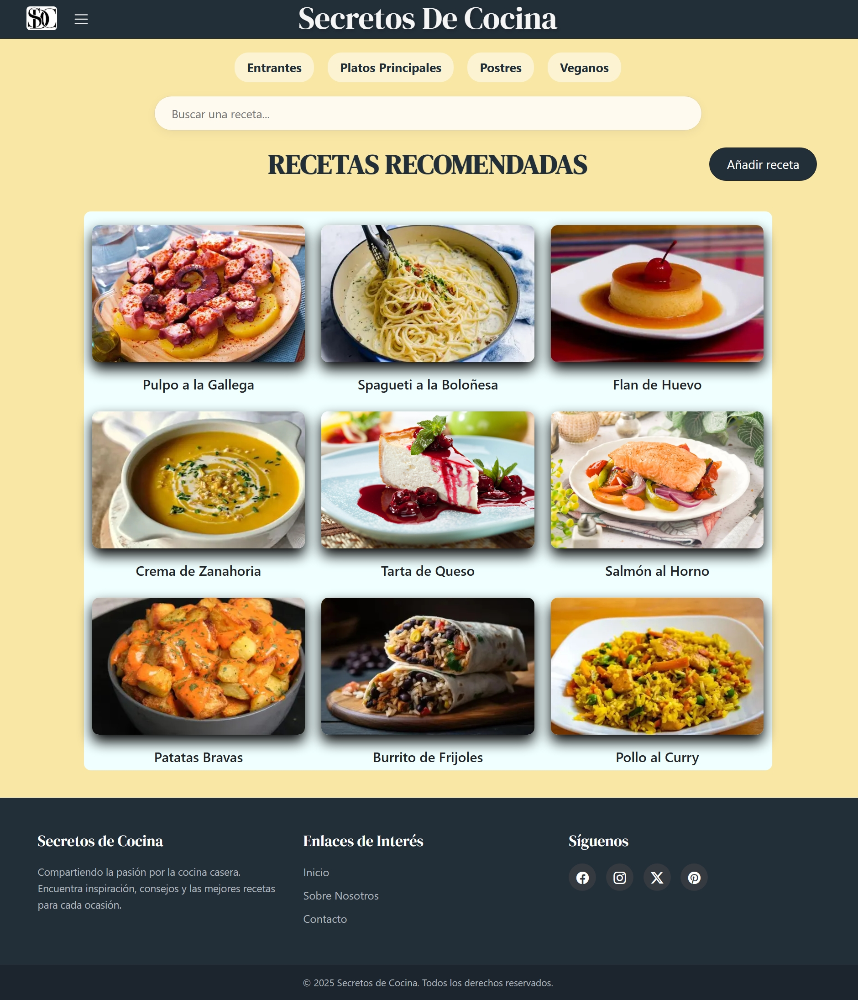
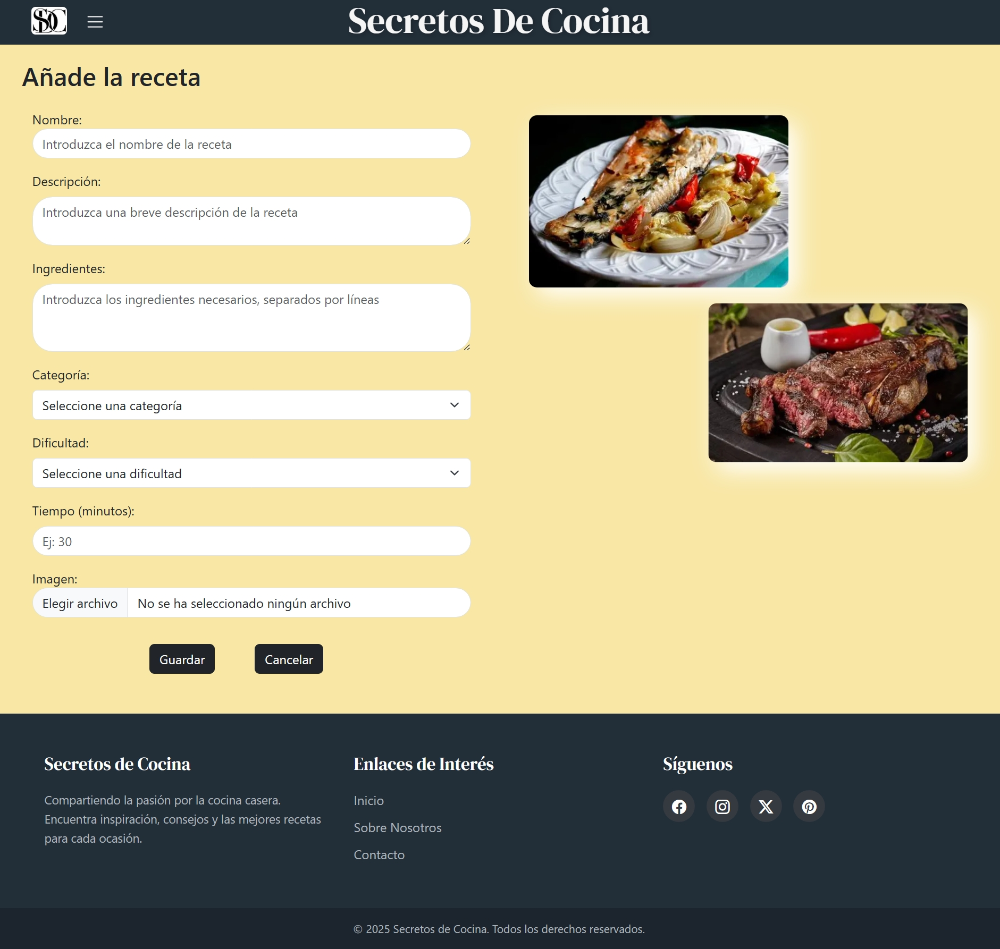
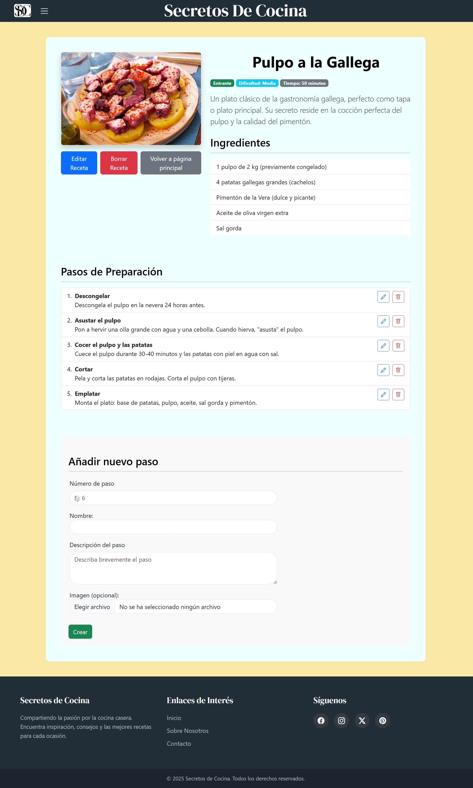

# Secretos de Cocina

A website for homemade recipes.

## Development team

| Full Name         | Official URJC email address                | GitHub      |
|-------------------------|------------------------------------------|-------------|
| Fernán Rama Hombreiro   | f.rama.2024@alumnos.urjc.es              | [fernanrama](https://github.com/fernanrama) |
| Izan Calle Feijoo       | i.calle.2024@alumnos.urjc.es             | [IzanCalle](https://github.com/IzanCalle)   |
| Rubén Torres Rivero     | r.torresr.2024@alumnos.urjc.es           | [Ruben2843](https://github.com/Ruben2843)   |

## Coordination tools

We do not use Trello.
If we incorporate any tool, we will add the link here.

## Functionality

###  Entities

- Main Entity: Recipe  
  Attributes:  
  - id (unique numeric identifier)  
  - name (string)
  - description (string describing the recipe)
  - ingredients (string)
  - category (string: dessert, starter, main dish, vegan)  
  - preparation_time (integer, in minutes)  
  - difficulty (string: easy, medium, dificult)
  - image (image file)

- Secondary Entity: Step  
  Attributes:  
  - id (unique numeric identifier) 
  - name (string, name of the step) 
  - order (integer, indicates the step number in the sequence)
  - description (detailed text of the step)  
  - image (optional, shows the result of that intermediate step)

### Images

- Each recipe may have one or several images showing the finished dish.
- Each step may include an image showing the intermediate state of the preparation.

### Categorization
We will use categorization queries for the recipes.
The user will be able to consult recipes according to their category:

- Starters 
- Main dish  
- Desserts  
- Vegans

### Search engine  
We will add a search bar to the website to make it easier to explore the different recipes.

## Practice 1

### Screenshots

  

  

  

### Members Participation

#### Rubén Torres Rivero

I have been working on the index.html, creating and improving its design to make it look nice and ensuring that the grid is responsive.
However, most of my work has been focused on the AñadirReceta.html page, as I was the one who created that page, the form, and the images on the right side.

5 most important commits:

  1. Creation of the form in the AñadirReceta.html: https://github.com/CodeURJC-FW-2025-26/webapp02/commit/96afaf88d0b151c30b76c58a8ba5ea5a2d8559bb
  2. Creation of the grid in the index.html: https://github.com/CodeURJC-FW-2025-26/webapp02/commit/1906256d8950cf646be112afbca4de00ecec0d34
  3. Achieve that the grid is responsive: https://github.com/CodeURJC-FW-2025-26/webapp02/commit/5da793c4ae0a8c309ba337b683dd247541c2015b
  4. Non- final decoration of the AñadirReceta.html: https://github.com/CodeURJC-FW-2025-26/webapp02/commit/613c454de76fecfe63e99ec2be19431934963813
  5. Delete of the edit and delete ingredient buttons (they were unnecessary): https://github.com/CodeURJC-FW-2025-26/webapp02/commit/65bc5ce655816af879e6af08448177cca71f8073

The 5 files I have worked on the most are:
  1. AñadirReceta.html (https://github.com/CodeURJC-FW-2025-26/webapp02/blob/main/A%C3%B1adirReceta.html)
  2. Index.html (https://github.com/CodeURJC-FW-2025-26/webapp02/blob/main/Index.html)
  3. Cocina.css (https://github.com/CodeURJC-FW-2025-26/webapp02/blob/main/Cocina.css)
  4. Pulpo.html (https://github.com/CodeURJC-FW-2025-26/webapp02/blob/main/Pulpo.html)
  5. PatatasBravas.html (https://github.com/CodeURJC-FW-2025-26/webapp02/blob/main/PatatasBravas.html)

#### Izan Calle Feijoo

I have been working in several areas of the page, trying to improve its design and to add functionalities, as well as creating the layout for the webpage. I have also worked in the detail page, especially in its firsts versions, looking up the content and creating and detailing de layout with flexbox. Also, I have reviewed all of the pages to check if everything was in the right place, trying to make it easy to use for the average user.

5 most important commits:

  1. Creation of the navigation bar and top layout in the main page: https://github.com/CodeURJC-FW-2025-26/webapp02/commit/e8a3bfb4e46a2f997f76f9e50d200e0ca5f74374
  2. Creation of the "Añadir Receta" button and improvement of the CSS: https://github.com/CodeURJC-FW-2025-26/webapp02/commit/51a3bd785713f42916e876e5d1ba2a020f7f2979
  3. Color palette change and creation of the footer: https://github.com/CodeURJC-FW-2025-26/webapp02/commit/640b2bcfa7ff3851ddeaf907f47b5246c5d12e93
  4. Creation of the layout and content of the first 2 detail pages (Pulpo.html and PatatasBravas.html): https://github.com/CodeURJC-FW-2025-26/webapp02/commit/b9c6be3757ead0e74e4c3ad2009423e9988d9ecc
  5. Change in the style of the top header, including font style: https://github.com/CodeURJC-FW-2025-26/webapp02/commit/9e9be4fdfc60c73f56b103cdf08d2fd23d5abddd

The 5 files I have worked on the most are:

  1. Index.html: https://github.com/CodeURJC-FW-2025-26/webapp02/blob/main/Index.html
  2. Cocina.css: https://github.com/CodeURJC-FW-2025-26/webapp02/blob/main/Cocina.css
  3. Pulpo.html: https://github.com/CodeURJC-FW-2025-26/webapp02/blob/main/Pulpo.html
  4. PatatasBravas.html: https://github.com/CodeURJC-FW-2025-26/webapp02/blob/main/PatatasBravas.html
  5. Añadir receta.html: https://github.com/CodeURJC-FW-2025-26/webapp02/blob/main/A%C3%B1adirReceta.html

#### Fernán Rama Hombreiro

I have been working mainly on trying to give the entire website a more professional look. Starting from a very solid foundation laid by my colleagues, I have been able to improve the detail page (Pulpo.html) so that it has an aesthetic worthy of a serious project. 
Also, thanks to the good foundation we had built, I have been refining the most important sections so that the project adheres to the guidelines given.  
Lastly, I organised the code contained in the files into sections to make it easier to understand and added comments that clearly explain each of the project's functionalities.

5 most important commits:

  1. Modification and improvement of the detail page ‘Pulpo.html’: (https://github.com/CodeURJC-FW-2025-26/webapp02/commit/3837443d9d87b62e78b9467422e624dcdbf004e4#diff-722c545a3b7dec713c7a7e32fabd71a0f0e0afec4197d400e95ce146db9222ff)
  2. Restructuring and organisation of the pages ‘AñadirReceta.html’ and ‘Index.html’: (https://github.com/CodeURJC-FW-2025-26/webapp02/commit/d0b51dfe69646be2268b55baace1b070221b36da)
  3. Improvement of headers and footers in all files for a more professional look: (https://github.com/CodeURJC-FW-2025-26/webapp02/commit/fd5ded0cafa585b198651cae40c297e1f231aec2)
  4. Added comments to improve understanding of the entire code. All files: (https://github.com/CodeURJC-FW-2025-26/webapp02/commit/66c3dc50e96a2d0e4e088227e45fbdca28520546)
  5. Improved functionalities of the form on file "AñadirReceta.html": (https://github.com/CodeURJC-FW-2025-26/webapp02/commit/3837443d9d87b62e78b9467422e624dcdbf004e4)

The 5 files I have worked on the most are:
  1. Pulpo.html (https://github.com/CodeURJC-FW-2025-26/webapp02/blob/main/Pulpo.html)
  2. Index.html (https://github.com/CodeURJC-FW-2025-26/webapp02/blob/main/Index.html)
  3. Cocina.css (https://github.com/CodeURJC-FW-2025-26/webapp02/blob/main/Cocina.css)
  4. AñadirReceta.html (https://github.com/CodeURJC-FW-2025-26/webapp02/blob/main/A%C3%B1adirReceta.html)
  5. PatatasBravas.html (https://github.com/CodeURJC-FW-2025-26/webapp02/blob/main/PatatasBravas.html)

## Practice 2

### Execution Instructions

To run this application, you will need Node.js (version 18 or higher) and MongoDB Server (version 5 or higher) installed on your system.

1.  Clone the repository or download the "practica2" release ZIP file and unzip it.
2.  Navigate to the project's root directory in your terminal.
3.  Run the command `npm install` to install all the necessary dependencies listed in `package.json`.
4.  Ensure your MongoDB server is running.
5.  Start the application with the command `npm start`. This will execute `src/app.js`. The script will automatically connect to the database, seed it with initial data if it's empty, and start the web server.
6.  Open your web browser and go to `http://localhost:3000`.

### File Description

The project is structured following a professional, modular approach:

-   `data/`: Contains the initial static data, including `recipes.json` and the source images.
-   `public/`: Holds all static assets served to the client, like the `Cocina.css` stylesheet and public images (e.g., the logo).
-   `src/`: The main source code for the application.
    -   `routes/`: Contains the routing logic.
        -   `main.js`: The application's main router. It defines all URL endpoints, handles requests (GET, POST), validates form data, and interacts with the MongoDB database to manage recipes and their steps.
    -   `views/`: Contains all the Mustache HTML templates.
        -   `partials/`: Reusable components like `header.html` and `footer.html`.
        -   Other `.html` files are the different pages of the application (index, recipe detail, form, etc.).
    -   `uploads/`: This folder is where user-uploaded images are stored. It is created automatically if it doesn't exist.
    -   `app.js`: The main entry point of the application. It configures and starts the Express server, sets up the Mustache template engine, serves static files, connects to the database, and imports the main router.
    -   `database.js`: Handles the MongoDB connection. It exports a `connect` function and the `db` object for other modules to access the active database connection.
    -   `loadData.js`: This script seeds the database. It loads initial recipes from `recipes.json` and copies their images to the `uploads` folder if the database is detected as empty on startup.
    -   `multerConfig.js`: Configures the Multer middleware, specifying that uploaded files should be saved to the `uploads/` folder with a unique name to prevent collisions.

### Demonstration video

The video demonstrating the functionality is available at: https://youtu.be/g-BBM9ncu94
### Members Participation

#### Fernán Rama Hombreiro

For Practice 2, my primary role was the architecture and implementation of the application's backend. I was responsible for setting up the Express server, establishing the database connection, and developing all the core API routes in `main.js`. This included the full CRUD (Create, Read, Update, Delete) logic for both the main entity (recipes) and the secondary entity (steps), implementing the server-side validation middleware, and configuring the image upload functionality with Multer.

**5 most important commits:**

  1. [Initialise Express server and database connection](https://github.com/CodeURJC-FW-2025-26/webapp02/commit/a3dc8ea9a19c4275c08fecf95a78fb3ee170a807)
  2. [Implement main recipe listing with pagination](https://github.com/CodeURJC-FW-2025-26/webapp02/commit/a52d6dcd225d52f4961f87e2d207425e8950e692)
  3. [Add server-side validation middleware](https://github.com/CodeURJC-FW-2025-26/webapp02/commit/0cbe890cf9352f49727bae8cb9413b5b5320efc2)
  4. [Implement recipe creation and image upload](https://github.com/CodeURJC-FW-2025-26/webapp02/commit/c2343aa7cff4c74fb2120a69b0b971fd4ed7c260)
  5. [Implement full CRUD for secondary entity (steps)](https://github.com/CodeURJC-FW-2025-26/webapp02/commit/b26cbe19f18463b7a22800ce3a8491cfc0b226e1)

**The 5 files I have worked on the most are:**

  1. [src/routes/main.js](https://github.com/CodeURJC-FW-2025-26/webapp02/blob/main/src/routes/main.js)
  2. [src/app.js](https://github.com/CodeURJC-FW-2025-26/webapp02/blob/main/src/app.js)
  3. [src/database.js](https://github.com/CodeURJC-FW-2025-26/webapp02/blob/main/src/database.js)
  4. [src/multerConfig.js](https://github.com/CodeURJC-FW-2025-26/webapp02/blob/main/src/multerConfig.js)
  5. [src/views/detalleReceta.html](https://github.com/CodeURJC-FW-2025-26/webapp02/blob/main/src/views/detalleReceta.html) 

---

#### Rubén Torres Rivero

In practice 2 my main work was on code quality and UX, adding advanced search features and essential security validations. I executed a key refactor to unify forms, improving project efficiency and stability. The result is a more robust application.

5 most important commits:

  1. [Retaining form data after error](https://github.com/CodeURJC-FW-2025-26/webapp02/commit/64b12a32257884121adc92cb9621639298d4a21a)
  2. [Add robust search and category filtering](https://github.com/CodeURJC-FW-2025-26/webapp02/commit/0401b948edc0eac6e60c014852d81636c09f1c18)
  3. [Recipe creation and editing complete](https://github.com/CodeURJC-FW-2025-26/webapp02/commit/7ae190e4132b8a9e3157a2b12c29acefc1b7e379)
  4. [Prevent crash from invalid ID](https://github.com/CodeURJC-FW-2025-26/webapp02/commit/6dfb4f73f5ee96e36acce3420df66fe565bd52e8)
  5. [Enhance recipe detail page layout](https://github.com/CodeURJC-FW-2025-26/webapp02/commit/621cb68368f0ec1c6f9b2bda34d267c2297c4203)

The 5 files I have worked on the most are:

  1. [src/routes/main.js](https://github.com/CodeURJC-FW-2025-26/webapp02/blob/main/src/routes/main.js)
  2. [src/views/AñadirReceta.html](https://github.com/CodeURJC-FW-2025-26/webapp02/blob/main/src/views/A%C3%B1adirReceta.html)
  3. [src/views/detalleReceta.html](https://github.com/CodeURJC-FW-2025-26/webapp02/blob/main/src/views/detalleReceta.html)
  4. [src/views/index.html](https://github.com/CodeURJC-FW-2025-26/webapp02/blob/main/src/views/Index.html)
  5. [README.md](https://github.com/CodeURJC-FW-2025-26/webapp02/blob/main/README.md)

### Izan Calle Feijoo

5 most important commits:

  1. [feat: Implement recipe deletion functionality]()
  2. [feat: Create dynamic confirmation and error pages](https://github.com/CodeURJC-FW-2025-26/webapp02/commit/34cd1aff950a89521981c093bf1eaa9a5aad55e1)
  3. 
  4. 
  5. 

The 5 files I have worked on the most are:

  1. [src/routes/main.js](https://github.com/CodeURJC-FW-2025-26/webapp02/blob/main/src/routes/main.js)
  2. [src/views/confirmation.html]([URL_TO_FILE_confirmation.html](https://github.com/CodeURJC-FW-2025-26/webapp02/blob/main/src/views/confirmacion.html)
  3. [src/views/error.html](https://github.com/CodeURJC-FW-2025-26/webapp02/blob/main/src/views/error.html)
  4. [src/views/Index.html](https://github.com/CodeURJC-FW-2025-26/webapp02/blob/main/src/views/Index.html)
  5. [public/css/Cocina.css](https://github.com/CodeURJC-FW-2025-26/webapp02/blob/main/public/css/Cocina.css)  
